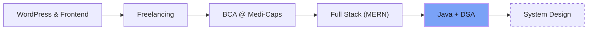
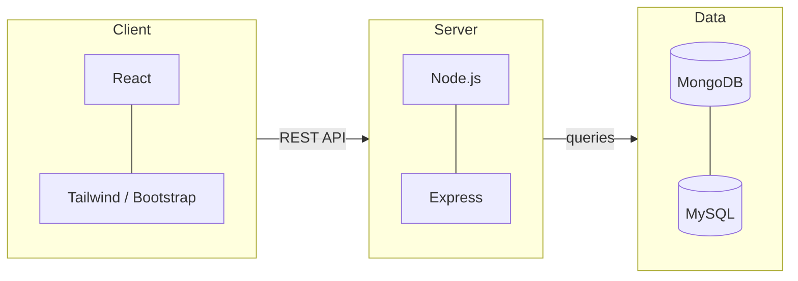

<div align="center">


<br/>

<a href="https://linkedin.com/in/amansethiyaa"></a>
<a href="https://x.com/amansethiyaa"></a>
<a href="mailto:amansethiya.dev@gmail.com"></a>


</div>

<br/>

## `~/journey`



## `~/architecture`

How I build things, end to end:



## `~/focus`

```yaml
status: open_to_work

now:
  - Java + Data Structures & Algorithms
  - MERN stack projects
  - Freelance client work

next:
  - System design

open_to:
  - Internships
  - Full-time roles
  - Freelance projects
```

## `~/toolbox`

<div align="center">


</div>

## `~/stats`

<div align="center">


<br/>


</div>

<br/>

<div align="center">

```java
public class Main {
    public static void main(String[] args) {
        System.out.println("Thanks for stopping by. Let's build something together.");
    }
}
```

</div>
